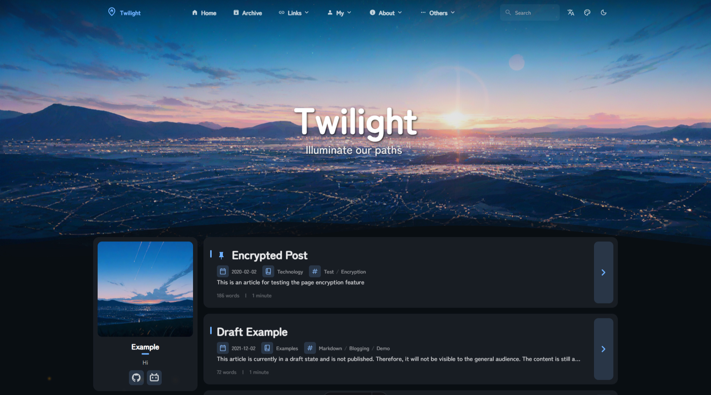
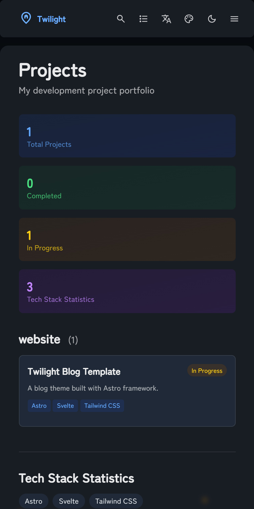
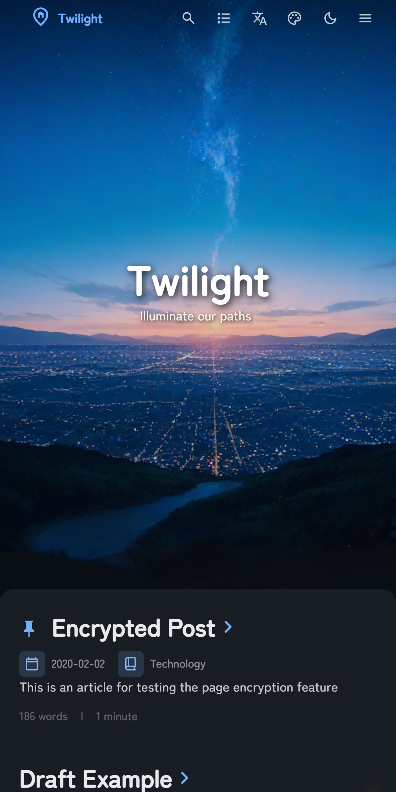

<div align = "center">

# Twilight

<table style="width: 100%; table-layout: fixed;">
  <tr>
    <td colspan="5"></td>
  </tr>
  <tr>
    <td></td>
    <td></td>
    <td></td>
    <td></td>
    <td></td>
  </tr>
</table>

A static blog built with [Astro](https://astro.build) framework.

[**🖥️ Live Demo**](https://twilight.spr-aachen.com)
[**📝 Documentation**](https://docs.twilight.spr-aachen.com)

</div>

---

## 📦 Installation

1. **Clone the repository:**
   ```bash
   git clone https://github.com/Spr-Aachen/Twilight.git
   cd Twilight
   ```

2. **Install dependencies:**
   ```bash
   # Install pnpm if not already installed
   npm install -g pnpm
   
   # Install project dependencies
   pnpm install
   ```

3. **Configure your blog:**
   - Edit `src/config.ts` to customize blog settings
   - Update site information, theme colors, banner images, and social links
   - Configure translation settings and feature page functionality

4. **Start the development server:**
   ```bash
   pnpm dev
   ```
   Your blog will be available at `http://localhost:4321`


## 📝 Content Management

- **Create new posts:** `pnpm new-post <filename>`
- **Edit posts:** Modify files in `src/content/posts/`
- **Customize special pages:** Edit files in `src/content/spec/`
- **Add images:** Place images in `src/assets/` or `public/`


## 🚀 Deployment

Deploy your blog to any static hosting platform:

- **Vercel:** Connect your GitHub repository to Vercel
- **Netlify:** Deploy directly from GitHub
- **GitHub Pages:** Use the included GitHub Actions workflow
- **Cloudflare Pages:** Connect your repository

Remember to update the `site` URL in `astro.config.mjs` before deployment!


## ⚡ Commands

All commands are run from the project root:

| Command                    | Action                                    |
|:---------------------------|:------------------------------------------|
| `pnpm install`             | Install dependencies                      |
| `pnpm dev`                 | Start local dev server at `localhost:4321`|
| `pnpm build`               | Build production site to `./dist/`        |
| `pnpm preview`             | Preview build locally before deployment   |
| `pnpm check`               | Run Astro error checking                  |
| `pnpm format`              | Format code with Biome                    |
| `pnpm lint`                | Check and fix code issues                 |
| `pnpm new-post <filename>` | Create a new blog post                    |
| `pnpm astro ...`           | Run Astro CLI commands                    |


## 🙏 Acknowledgements

- Based on the original [Fuwari](https://github.com/saicaca/fuwari) template
- Inspired by [Mizuki](https://github.com/matsuzaka-yuki/Mizuki) template
- Translation functionality powered by [translate](https://gitee.com/mail_osc/translate)