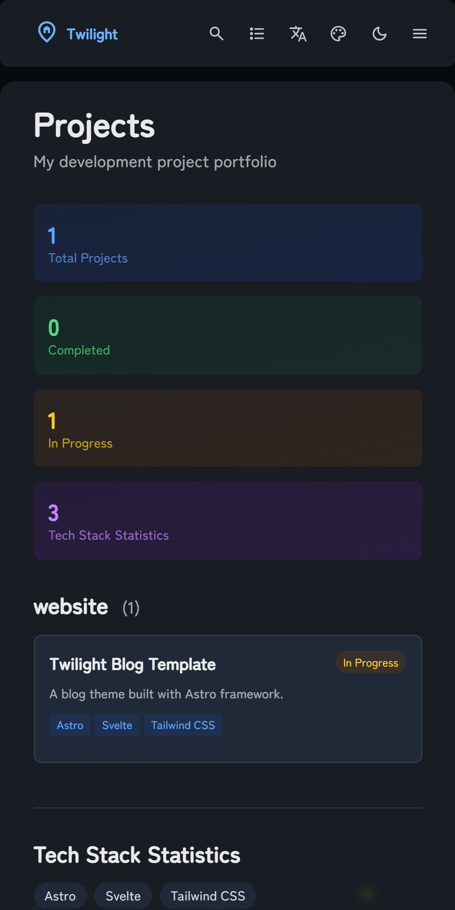
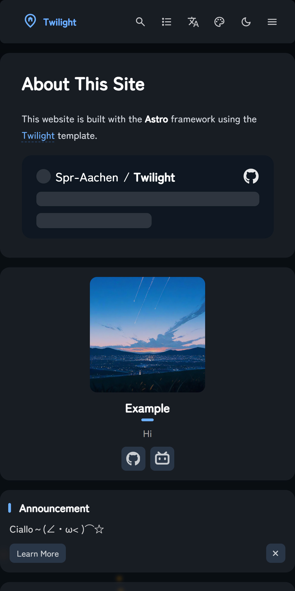
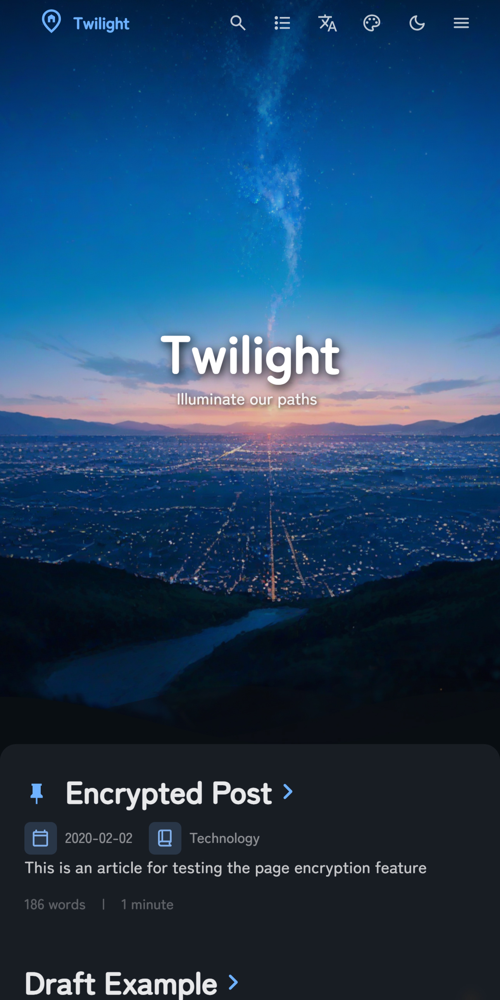
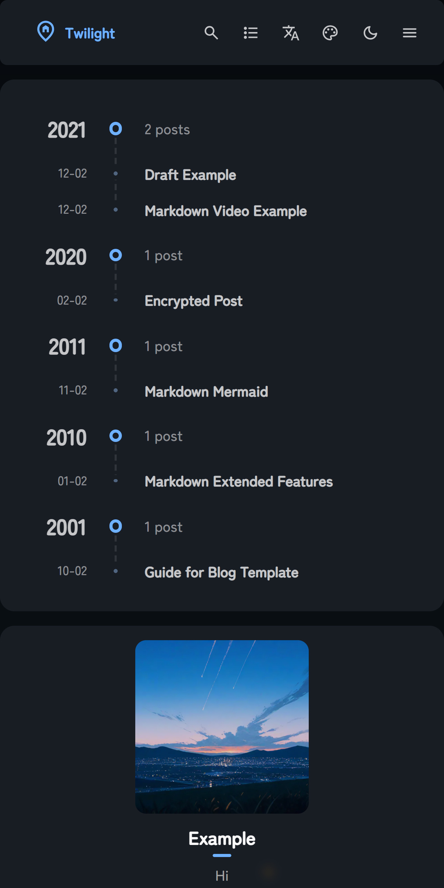

<div align = "center">

# Twilight

<table style="width: 100%; table-layout: fixed;">
   <tr>
      <td colspan="5"></td>
   </tr>
   <tr>
      <td></td>
      <td></td>
      <td></td>
      <td></td>
      <td></td>
   </tr>
</table>

一个基于 [Astro](https://astro.build) 框架的静态博客模板，专注于打造沉浸式的黑暗氛围

[**🖥️ 演示**](https://twilight.spr-aachen.com)
[**📝 文档**](https://docs.twilight.spr-aachen.com)

[**English**](../README.md) | 中文

</div>

---

## 📦 安装

1. **克隆仓库**
   ```bash
   git clone https://github.com/Spr-Aachen/Twilight.git
   cd Twilight
   ```

2. **安装依赖**
   ```bash
   # Install pnpm if not already installed
   npm install -g pnpm
   
   # Install project dependencies
   pnpm install
   ```

3. **配置博客**
   - Edit `src/config.ts` to customize blog settings
   - Update site information, theme colors, banner images, and social links
   - Configure translation settings and feature page functionality

4. **本地调试**
   ```bash
   pnpm dev
   ```
   Your blog will be available at `http://localhost:4321`


## 📝 内容管理

- **创建帖子:** `pnpm new-post <filename>`
- **编辑帖子:** Modify files in `src/content/posts/`
- **自定义页面:** Edit files in `src/content/spec/`
- **添加图片:** Place images in `src/assets/` or `public/`


## 🚀 部署

- **Vercel:** 从 GitHub 导入仓库
- **Netlify:** 从 GitHub 导入仓库
- **GitHub Pages:** 使用已包含的 GitHub Actions 工作流
- **Cloudflare Pages:** 从 GitHub 导入仓库

部署之前记得更新 `astro.config.mjs` 中的 `site` URL!


## ⚡ 命令

| Command                    | Action                           |
|:---------------------------|:---------------------------------|
| `pnpm install`             | 安装依赖                         |
| `pnpm dev`                 | 在 `localhost:4321` 启动本地服务器|
| `pnpm build`               | 构建站点到 `./dist/`              |
| `pnpm preview`             | 在部署前本地预览构建               |
| `pnpm check`               | 运行 Astro 错误检查               |
| `pnpm format`              | 使用 Biome 格式化代码             |
| `pnpm lint`                | 检查并修复代码问题                 |
| `pnpm new-post <filename>` | 创建新博客文章                     |
| `pnpm astro ...`           | 运行 `Astro CLI` 命令             |


## 🙏 致谢

- 基于原版的 [Fuwari](https://github.com/saicaca/fuwari) 模板二次开发
- 灵感来源于 [Mizuki](https://github.com/matsuzaka-yuki/Mizuki) 模板
- 翻译功能的实现得益于 [translate](https://gitee.com/mail_osc/translate)